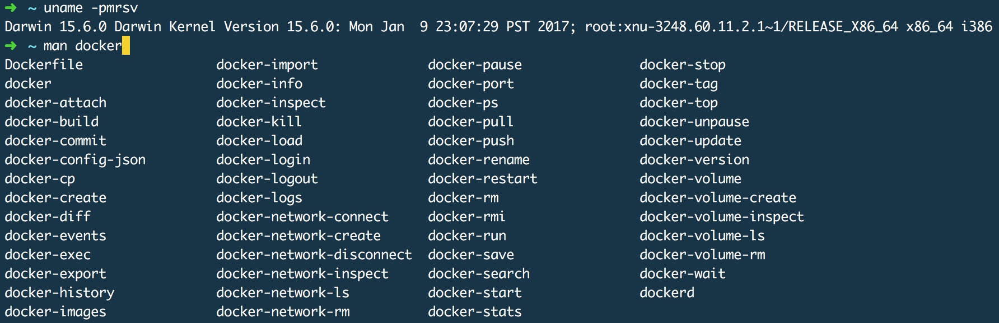

Docker Man Pages for OS X
=========================

**Install the man pages for `docker` on your Mac OS X system using docker and go-md2man.**  

Useful when combined with [Docker for Mac](https://docs.docker.com/docker-for-mac/), [dlite](https://github.com/nlf/dlite) or [Triton](https://docs.joyent.com/public-cloud/api-access/docker)



## Prereqs
- The script assumes that you are using Mac Homebrew on your OS X system. (http://brew.sh)  

- The script assumes you have `docker` and `git` installed and an active internet connection to pull the docker git repository and a docker image to your local system.

## Usage

To install the man pages, just run the script:  
`./docker-man-pages-osx.sh`

Then to view any docker related man page, just use man like normal!  
**Perfect for offline usage!**

```
# examples
man docker
man Dockerfile
man docker-run
man docker-inspect
man docker-exec
man docker-attach
etc, etc.
```

For a full listing of all the man pages that get installed run:  
```
ls -l /usr/local/share/man/man1/docker*
ls -l /usr/local/share/man/man5/docker*
ls -l /usr/local/share/man/man8/docker*
```


## Caveats
- Not all the generated man pages will apply to your Docker installation on a Mac. Nevertheless, the bulk of these are still useful for quick reference without leaving the terminal or for offline usage.

- These man pages are installed outside of Homebrew, therefore are likely to be out of date or stale or out of sync with your currently installed version of docker at any given time.

- Run the script occasionally to update the pages in the event that the Docker core team updates things on their side.

## go-md2man
current: https://hub.docker.com/r/savant/md2man/

original: https://github.com/cpuguy83/go-md2man  
(image not found on Docker Hub anymore as of 2017-03-05)

### References

Originally adapted from:
http://stackoverflow.com/a/32239112  
Stackoverflow users: [Serg](http://stackoverflow.com/users/131337/serg) + [Gilly](http://stackoverflow.com/users/3903368/gilly)
